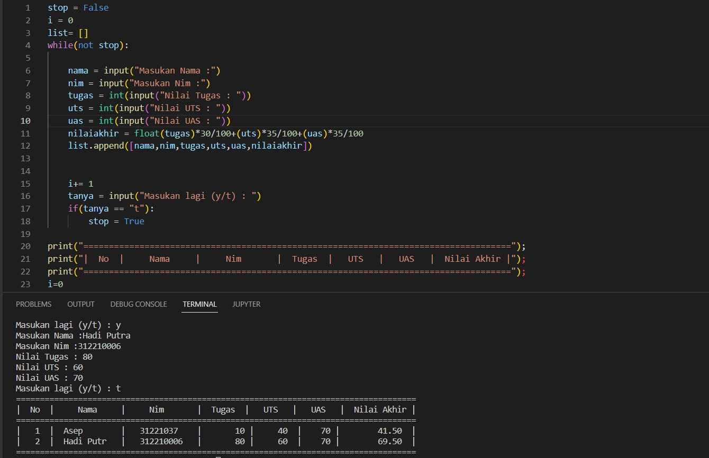

# praktikum5

# Buat program sederhana untuk menambahkan data kedalam sebuah list dengan rincian sebagai berikut:

- Progam meminta memasukkan data sebanyak-banyaknya (gunakan perulangan) • Tampilkan pertanyaan untuk menambah data (y/t?), apabila jawaban t (Tidak), maka program akan menampilkan daftar datanya. • Nilai Akhir diambil dari perhitungan 3 komponen nilai (tugas: 30%, uts: 35%, uas: 35%) • Buat flowchart dan penjelasan programnya pada README.md. • Commit dan push repository ke github
# Menggunakan perulangan while
```bash
membuat list []
membuat stop = false
while(tidak berhenti)
ketikan nama,nim,(uts,uas,dengan menjadikanya interger),nilai akhir dengan fungsi float agar bisa menampilkan angka koma
lalu menambah list dengan .append dengan buka kurung seperti dibawah
membuat kondisi dimana ingin masukan lagi data y/t jika t makan kondisi stop true
dan akan berhenti.
dan apabila stop t maka membuat syntax seperti dibawah membuat list dengan rapih menggunakan kondisi string.format
```

stop = False i = 0 list= [] while(not stop):

```bash
nama = input("Masukan Nama :")
nim = input("Masukan NIM : ")
tugas = int(input("Nilai Tugas : "))
uts = int(input("Nilai UTS : "))
uas  = int(input("Nilai UAS : "))
nilaiakhir = float(tugas)*30/100+(uts)*35/100+(uas)*35/100
list.append([nama,nim,tugas,uts,uas,nilaiakhir])

i+= 1
tanya = input("Masukan lagi (y/t) : ")
if(tanya == "t"):
    stop = True
```        

print("====================================================================================");        
print("|  No  |     Nama     |     Nim       |  Tugas  |   UTS   |   UAS   |  Nilai Akhir |");
print("====================================================================================");
i=0
for x in list:
    i+=1
    print("|  {6:2}  |  {0:10}  |   {1:9}   |  {2:7} |  {3:5}  |{4:6} |  {5:11.2f}  |"\
        .format (x[0][:9] , x[1][:9],x[2],x[3],x[4],x[5], i))
print("====================================================================================");

- gambar




